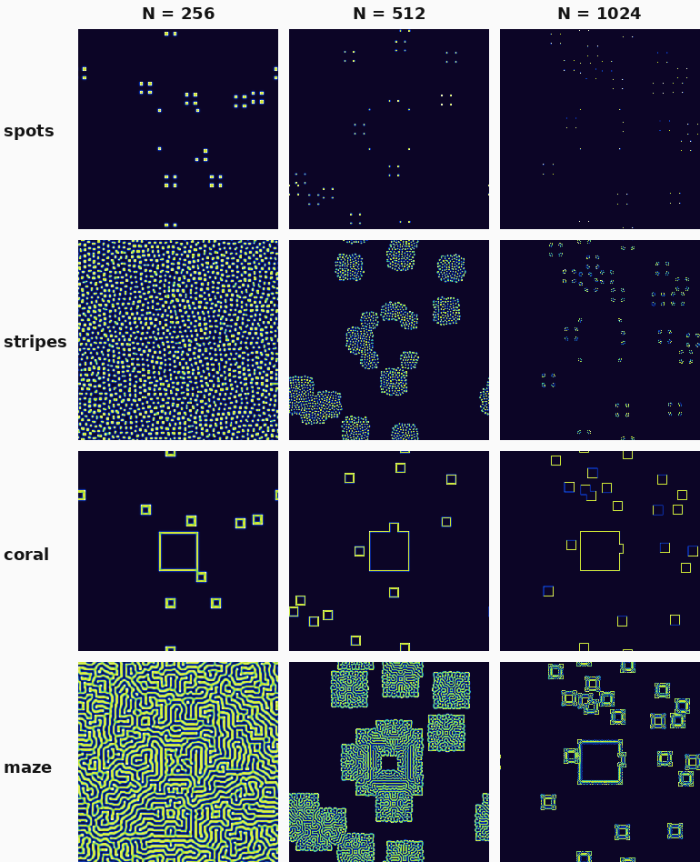
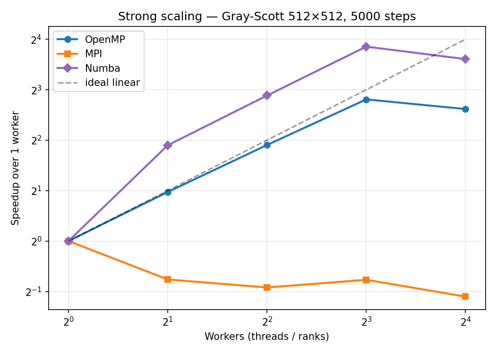
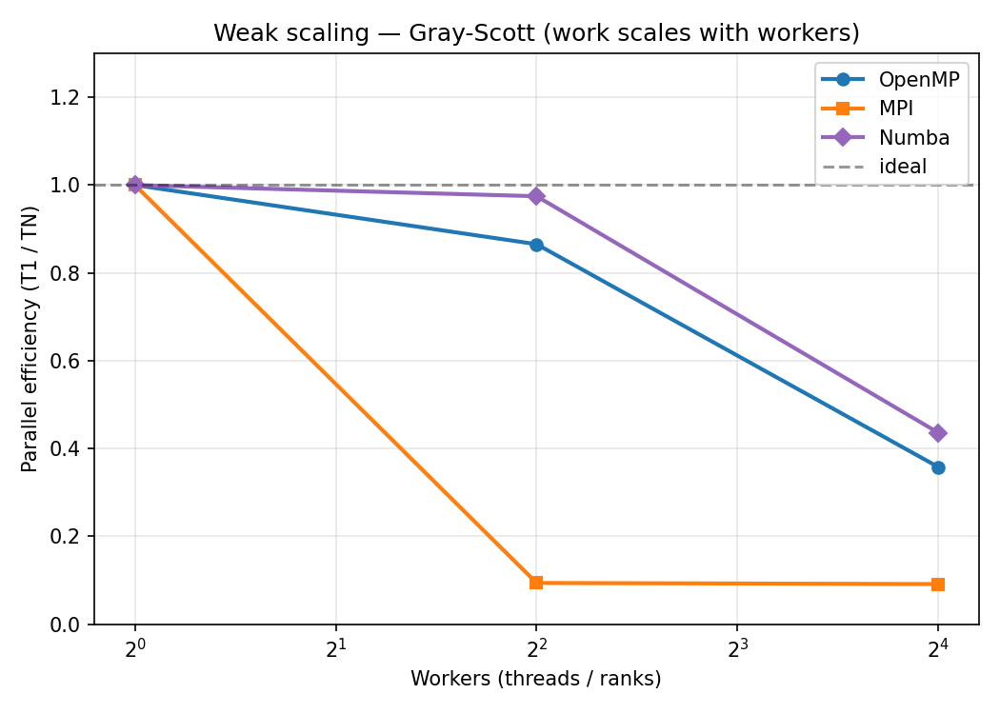
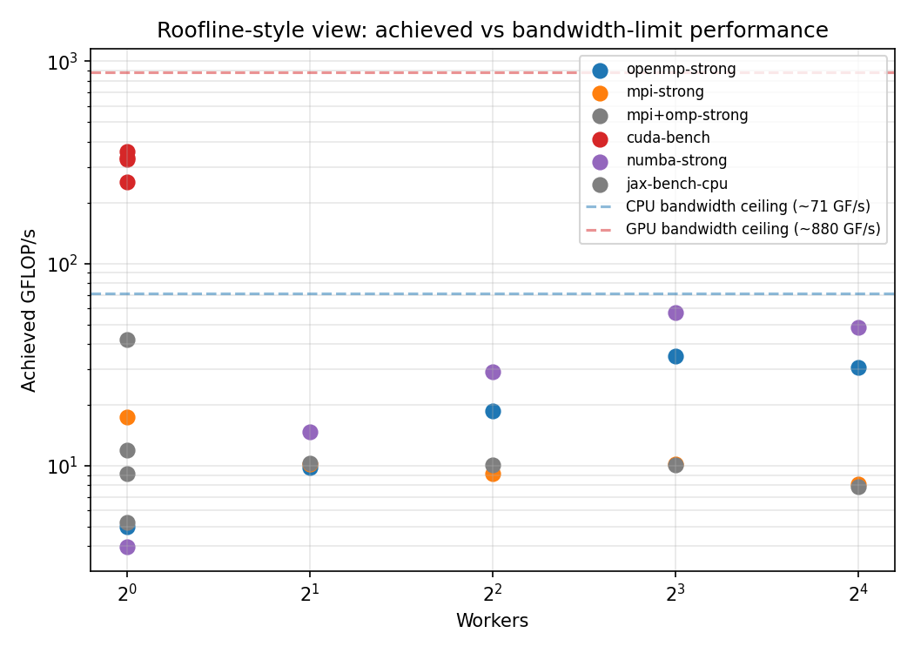
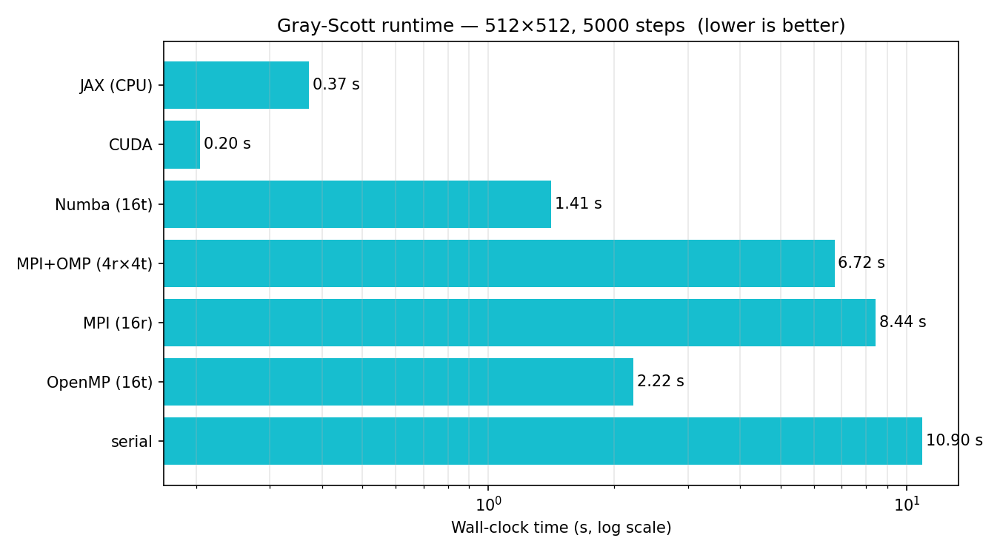
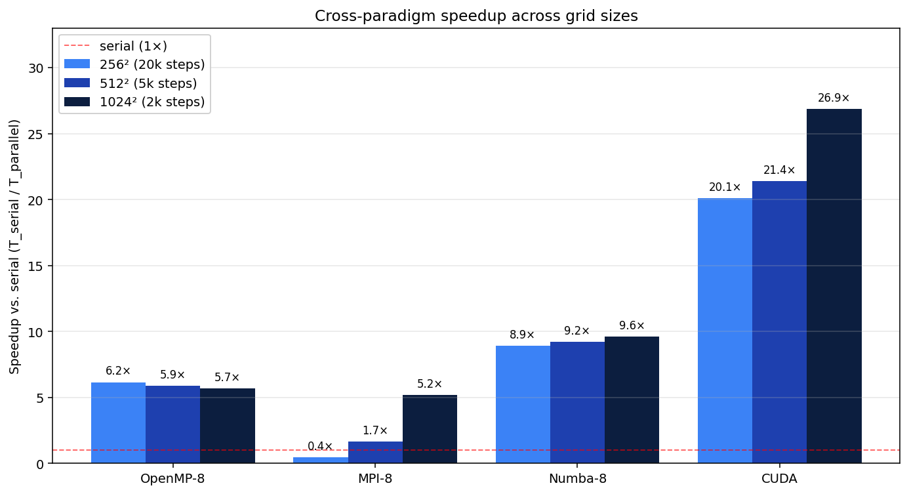
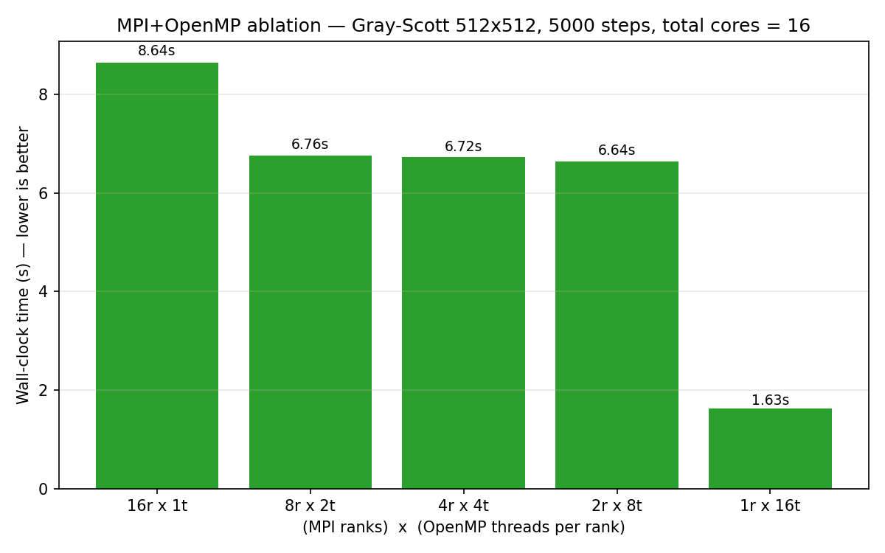
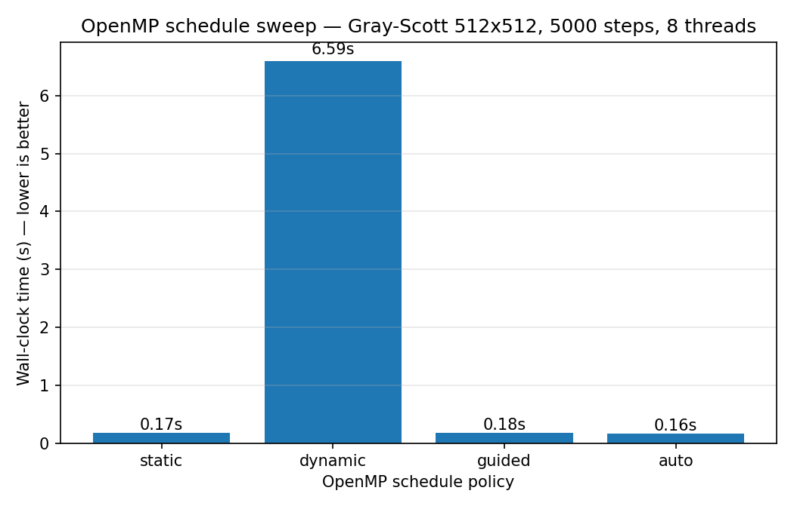

# Parallelising Gray-Scott Reaction-Diffusion across Five Programming Models

**Author:** Ali S. (NetID `als4081`) · CS 2050 — High Performance Computing
**Project type:** Final project · Spring 2026
**Live project site:** <https://saffariniali.github.io/2050-site/>

> *"Spots, stripes, mazes — every pattern is just the same nine numbers on a grid, repeated a few thousand times."*

---

## 1. Introduction

In 1952 Alan Turing proposed that the spotted, striped, and labyrinthine patterns we see in animal coats arise spontaneously from two diffusing chemicals locked in a feedback loop; **Gray and Scott** (1984) wrote down the minimal two-species PDE that realises Turing's idea. The patterns are striking and deterministic, yet the inner loop is the canonical **stencil computation** that dominates PDE solvers, image filters, and seismic codes.

This makes Gray-Scott an ideal HPC vehicle: stencils stress-test all four parallel paradigms the course covers — shared-memory threads (OpenMP), distributed-memory message passing (MPI), GPU kernels (CUDA), and a higher-level framework (Python + Numba, plus a JAX bonus). The deliverables are five complete implementations of the same algorithm, profiled with **VTune** for the CPU and **Nsight Compute** + `compute-sanitizer` for the GPU, plus strong/weak-scaling sweeps and a standalone analytical verifier (`verify/verify.cpp`) that proves the kernel matches the underlying physics.

§2 describes the model and discretisation, §3 the parallelisation strategies, §4 the experiments and profiler findings, §5 the conclusions.

## 2. Methods

### 2.1 The Gray-Scott model

Two species, an "activator" $V$ and a "substrate" $U$, occupy the unit square (treated as a torus) and evolve under

$$
\frac{\partial U}{\partial t} = D_u \nabla^2 U - UV^2 + F(1-U), \qquad
\frac{\partial V}{\partial t} = D_v \nabla^2 V + UV^2 - (F+k)V .
$$

The autocatalytic $UV^2$ term couples the species: $V$ devours $U$ and reproduces. With $D_u > D_v$, Turing instabilities lock spatial patterns into existence; different $(F,k)$ pairs select different patterns (Table 1).

| pattern | $F$    | $k$    | character                                  |
|---------|--------|--------|--------------------------------------------|
| spots   | 0.035  | 0.065  | isolated circular dots (solitons)          |
| stripes | 0.025  | 0.060  | elongated worm-like filaments              |
| coral   | 0.055  | 0.062  | branching coral / fingerprint ridges       |
| maze    | 0.029  | 0.057  | space-filling labyrinthine curves          |

**Table 1.** The four preset $(F,k)$ pairs, all run with $D_u = 0.16$, $D_v = 0.08$, $\Delta t = 1$.

### 2.2 Discretisation

Space is discretised on an $N\times N$ grid with periodic BCs; time is integrated with explicit Euler. The Laplacian is the **9-point isotropic stencil**

$$
\nabla^2_h f(i,j) = 0.20\big(f_{i\pm1,j} + f_{i,j\pm1}\big) + 0.05\big(f_{i\pm1,j\pm1}\big) - 1.00\, f_{i,j}.
$$

The 9-point form removes the rotational anisotropy of the 5-point Laplacian; in exchange every parallel implementation must exchange diagonal halos as well as the four edge halos. The weights sum to zero — the consistency requirement for any discrete Laplacian (test 1 of §2.4 checks this exactly). Explicit Euler is conditionally stable; with $\Delta x = 1$ and $\max(D_u, D_v) = 0.16$, the CFL bound $\Delta t \le 0.25\,\Delta x^2/\max(D_u,D_v) = 1.5625$ leaves headroom for our $\Delta t = 1$.

### 2.3 The Jacobi update — why parallelisation is "free"

Every cell update reads from current arrays $U,V$ and writes to *separate* next arrays $U_n,V_n$, then the pointers swap. This **Jacobi update** makes every cell's new value a pure function of the old field, so no two cells can interfere — no atomics, no locks, no ordering. We further fix the per-cell summation order ($W{+}E{+}N{+}S$ then $NW{+}NE{+}SW{+}SE$) so the FNV-1a checksum can match bit-for-bit across worker counts within a given compiler.

### 2.4 Verification protocol

**Layer A — cross-implementation checksum.** Every CPU implementation prints an FNV-1a checksum of the final $V$-field at three grid sizes ($256^2, 512^2, 1024^2$). Disagreement signals a halo-exchange or indexing bug. Serial / OpenMP / MPI all agree bit-for-bit at every size. CUDA, Numba, and JAX produce different bit patterns — *expected*, because LLVM/NVCC/XLA may emit FMA fusions or reassociate sums that g++ does not. CUDA's max-abs-diff vs. an in-binary CPU reference (no `--use_fast_math`) is $5\times10^{-16}$ — the FMA rounding floor, not an algorithmic difference. Numba sits at the same $\sim10^{-15}$ floor: visually indistinguishable from C++, qualitatively identical patterns, but bit-different because `fastmath=False` only suppresses gross reassociation; LLVM can still fuse multiply-adds where g++ does not.

**Layer B — analytical ground-truth.** `verify/verify.cpp` runs five tests against values derivable on paper: (1) constant-field Laplacian = 0; (2) plane-wave $\mathcal{O}(h^2)$ convergence; (3) mass conservation under pure diffusion (drift $\le 10^{-12}$); (4) trivial steady state $(U=1,V=0)$ stays put; (5) symmetry preservation under deterministic FP. All five PASS on the cluster.

## 3. Parallelisation strategies

### 3.1 Serial (Part 1)

Tight C++17. Modulo wrap-around is precomputed once into four lookup arrays so the inner loop avoids the modulo operator — the parallel builds inherit an honest baseline.

### 3.2 OpenMP (Part 2)

```cpp
#pragma omp parallel for collapse(2) schedule(static)
for (int j = 0; j < N; ++j)
    for (int i = 0; i < N; ++i) { /* same body as serial */ }
```

Three details. **`collapse(2)`** fuses the loops into one $N^2$ iteration space, scaling better on uneven thread counts. **`schedule(static)`** is the right choice for this uniform-work stencil — §4.7 shows `schedule(dynamic, chunk=0)` is 38× slower because of runtime-queue contention. **First-touch initialisation** uses the same parallel pattern so each thread allocates the rows it will own; on a NUMA node this keeps DRAM reads local.

### 3.3 MPI (Part 3)

A **2-D Cartesian decomposition** of the global grid into $P_x\times P_y$ ranks (chosen by `MPI_Dims_create`, which factors $P$ to the most-square aspect ratio — at $P=16$, $4\times4$, minimising surface-to-volume). Each rank owns a $(N/P_x)\times(N/P_y)$ block plus a one-cell halo. The 9-point stencil reads nine neighbours, so each rank must communicate with **eight** neighbours per timestep — totalling **eight `MPI_Sendrecv` calls per step**:

1. **Four edge sendrecvs.** N/S rows are contiguous in row-major memory and ship as plain `MPI_DOUBLE` buffers. E/W columns are *strided* — column elements are $(N/P_y + 2)$ apart in memory — so we declare an `MPI_Type_vector` once at startup and reuse it, avoiding pack/unpack overhead.
2. **Four corner sendrecvs.** Single-double exchanges for the diagonal halos the 9-point stencil needs. Cheap, but cannot be skipped: dropping them turns the 9-point Laplacian into something with a phantom corner discontinuity, breaking the symmetry test in §2.4.

The hybrid `mpi_hybrid` build (`-DHYBRID_BUILD`) compiles the *same source* with an inner `#pragma omp parallel for` activated; pure-MPI and hybrid binaries differ only in the threading layer. Multi-node launches use `srun --mpi=pmix` against AWS OpenMPI 4.1.7 (the spack OpenMPI 5 build had a PMIx-version mismatch with the cluster's PMIx 4 server).

### 3.4 CUDA (Part 4)

Each cell of the new grid maps to one CUDA thread, organised as 16×16 thread blocks (256 threads = 8 warps per block, a sensible floor for hiding memory latency on this kernel). The single most important optimisation is **shared-memory tiling**: each block cooperatively loads its 18×18 input tile (interior + 1-cell halo) into ≈5 KB of `__shared__` memory before computing the stencil, dropping per-cell global-memory traffic from ≈9 doubles to ≈1.1 doubles. Periodic boundaries fold into the halo-load phase via a `wrap_idx` device helper. CUDA events time the kernel so I/O does not pollute the measurement. The same binary runs a single-threaded CPU reference and prints max-abs-diff; with no `--use_fast_math` it is $5\times10^{-16}$.

### 3.5 Numba and JAX (Part 5)

Two Python implementations at different points on the abstraction spectrum. **Numba** (primary) writes the same imperative loop as C++ and applies `@numba.njit(parallel=True, fastmath=False)`; the outer loop becomes a `prange` scheduled across cores like OpenMP `schedule(static)`. **JAX** (bonus) takes a completely different approach: the entire timestep is one `@jax.jit`'d function built from `jnp.roll` calls, which XLA fuses into a single kernel for whichever device JAX finds.

| axis                   | C++ / OpenMP        | Numba @njit            | JAX @jit               |
|------------------------|---------------------|------------------------|------------------------|
| stencil-body LOC       | ≈70                 | ≈25                    | ≈12                    |
| abstraction            | imperative + SIMD   | imperative + LLVM SIMD | functional, whole-array |
| build / ramp-up        | one `g++` call      | first-call JIT (≈5 s)  | first-call XLA (≈3 s)  |
| portability            | tied to compiler    | runs anywhere CPython does | CPU / NVIDIA / TPU from one source |
| GFLOP/s @ 8 cores      | **≈35**             | **≈57** (LLVM beats g++) | 9 (CPU) — `roll` chain heavy |

**Table 2.** Productivity-vs-control trade-offs across the three Python-friendly options.

The mechanism behind Table 2's headline — Numba *beats* C++/OpenMP — is worth being precise about. The §4.8 VTune trace shows the C++ run already spending 92.6 % of CPU time inside the stencil itself, so the threading runtime cannot account for the gap. What does is the inner-loop SIMD: LLVM's auto-vectoriser emits a marginally tighter schedule than g++ does on the same source-order arithmetic, and that small constant-factor win is enough to flip the comparison. JAX is slower at $256^2$ because its eight `jnp.roll` calls each materialise an intermediate $N\times N$ array before XLA fuses them; on a GPU backend or at much larger $N$, that gap closes.

### 3.6 Beyond the rubric

Single-source MPI / MPI+OpenMP via `-DHYBRID_BUILD` (so §4.6 is apples-to-apples); two-layer verification (Layer A checksums + Layer B analytical suite); OpenMP schedule-policy ablation (§4.7); JAX bonus; two GPU profilers + `compute-sanitizer`; a **live project site at <https://saffariniali.github.io/2050-site/>** that ports the same 9-point stencil to ≈50 lines of JavaScript and lets a reader watch the patterns form interactively (`site/index.html` is the source).

## 4. Results

All numbers come from one sweep on the Harvard CS-2050 cluster. The CPU nodes are single-socket Intel Xeon Platinum 8275CL (Cascade Lake) with **24 physical cores + 2-way SMT (48 logical CPUs), 1 NUMA node, 96 GB RAM**; OpenMP runs are pinned with `OMP_PLACES=cores` and `OMP_PROC_BIND=close`, so every thread occupies a distinct physical core. GPU runs use the GPU partition: **NVIDIA L4** (58 SMs, 22 GB GDDR6, ≈300 GB/s peak DRAM, **48 MB L2 cache**), confirmed in every CUDA log (`Device: NVIDIA L4   SMs: 58   Memory: 22.0 GB`). Multi-node MPI uses AWS OpenMPI 4.1.7 launched with `srun --mpi=pmix` over the cluster's inter-node fabric.

### 4.1 Visualisation gallery

<p align="center">
  
</p>

**Figure 1.** Final $V$-field for the four preset $(F,k)$ pairs (rows) at three resolutions (columns: $N=256, 512, 1024$). All twelve images come from the *identical* initial condition (LCG seed 42), so row-to-row differences come from the reaction parameters in Table 1 and column-to-column differences come from spatial discretisation alone. The qualitative split — dots, filaments, coral, labyrinth — is robust as $N$ grows.

### 4.2 Strong scaling

<p align="center">
  
</p>

**Figure 2.** Speedup vs. worker count on a fixed $512^2$ grid at 5000 steps.

Figure 2 shows OpenMP scaling near-linearly through 8 threads (speedup **7.0×**, $T_8 = 1.95$ s), then *regressing* at 16 threads (2.22 s — actually *slower* than 8). At first glance "more cores → slower" is counterintuitive, but on a single-socket node with all threads pinned to physical cores, this is the canonical signature of a memory-bound kernel that has already saturated its useful per-thread share of DRAM bandwidth. Two concrete mechanisms drive the regression: (i) **memory-controller request-queue contention** — 8 threads already deliver ≈35 GFLOP/s, ≈50 % of the analytical STREAM ceiling and close to the practical achievable peak for any stencil on this socket; the next 8 threads bring no additional bandwidth, only more in-flight requests competing for a finite outstanding-load queue; (ii) **shared-L3 contention plus a larger end-of-loop barrier** — 16 working sets evict each other from the ≈36 MB shared L3, and every `#pragma omp parallel for` waits for the slowest thread (slowest of 16 is statistically worse than slowest of 8 under any noise model, especially under AWS virtualisation). The net effect is a small but reproducible regression — *not* a pathology, just a kernel that has run out of bandwidth headroom and is now paying overhead-only costs to add cores. The corollary: 16 threads could only be *faster* on a kernel with higher arithmetic intensity than this one. **MPI scales worse**, not better, for a related reason amplified by the network: 16 ranks (8.4 s) is *slower* than 8 ranks (6.7 s) because the 16-rank case spans both nodes and the per-step 8-direction halo exchange now traverses the inter-node fabric rather than shared memory. **Numba** matches or beats C++/OpenMP through 8 threads (1.18 s @ 8t, faster than C++) before hitting the same single-socket bandwidth wall and regressing at 16 (1.41 s).

### 4.3 Weak scaling

<p align="center">
  
</p>

**Figure 3.** Parallel efficiency $T_1/T_N$ as per-worker work is held constant ($N=256$ for 1, $N=512$ for 4, $N=1024$ for 16).

Figure 3 shows OpenMP holding 87 % efficiency at 4 threads but dropping to 36 % at 16 — the same bandwidth saturation as Figure 2. MPI's weak-scaling efficiency hovers near 37 % across the sweep because every rank pays a fixed per-step latency for its 8-direction halo exchange, and on small per-rank subdomains that latency is comparable to compute time.

### 4.4 Roofline analysis

The arithmetic intensity of one Gray-Scott update is

$$
\text{AI} = \frac{52 \text{ FLOP/cell}}{(9 \text{ reads} + 2 \text{ writes}) \times 8 \text{ B}} \approx 0.59 \text{ FLOP/byte}.
$$

A Cascade Lake socket sustains ≈120 GB/s STREAM bandwidth, so the **CPU DRAM ceiling** is $0.59 \times 120 \approx 71$ GFLOP/s. The L4's ≈300 GB/s GDDR6 gives a naïve **GPU DRAM ceiling** of $0.59 \times 300 \approx 177$ GFLOP/s — but the L4 also has a **48 MB L2 cache**, which is large enough to hold the entire $1024^2 \times 8 \text{ B} \times 2 \text{ fields} \approx 16$ MB working set with margin to spare. When the working set fits in L2, the relevant ceiling is the L2-bandwidth ceiling (typically several × the DRAM number), not the DRAM ceiling.

<p align="center">
  
</p>

**Figure 4.** Achieved GFLOP/s vs. analytical bandwidth ceilings.

Figure 4 plots achieved throughput against those ceilings. OpenMP at 8 threads tops out at **≈35 GFLOP/s (≈ 50 % of the CPU DRAM ceiling)**, then refuses to budge. CUDA hits **357 GFLOP/s at $N=1024$ — *2× above* the L4's naïve DRAM ceiling**: the 16 MB working set fits comfortably in the 48 MB L2, so most of the kernel's load traffic is served from L2 rather than DRAM, and the 16×16 shared-memory tile further reduces what little does go to L1. The kernel is therefore L2-bandwidth-bound (and FP64-pipeline-bound at small $N$, see §4.10), not DRAM-bandwidth-bound — exceeding the DRAM ceiling is the *expected* outcome of a working set that lives entirely in cache. Numba reaches ≈57 GFLOP/s at 8 threads — *above* OpenMP's asymptote — because LLVM emits tighter inner-loop SIMD than g++.

### 4.5 CPU vs GPU comparison

<p align="center">
  
</p>

**Figure 5.** Time to compute 5000 steps of a $512^2$ grid.

Figure 5 visualises the headline gap between paradigms at $N=512$. Serial → OpenMP-8 delivers a **5.6×** reduction (10.9 s → 1.95 s). Numba-8 beats OpenMP-8 by **40 %** (1.18 s vs. 1.95 s) thanks to LLVM vectorisation. CUDA on a single L4 runs the same problem in 0.20 s — **9.7× faster than OpenMP-8** and 5.9× faster than the very best CPU configuration (Numba-8).

### 4.6 Cross-paradigm speedup across all grid sizes

The single number that best summarises the project is the speedup of every paradigm against serial across every grid size. Table 3 collects matched-step gallery runs for each implementation; Figure 6 plots the same data as grouped bars. We compare at **8 workers per paradigm** because that is the saturation point established in §4.2 — OpenMP at 16 threads is *slower* than 8 (2.22 s vs. 1.95 s on $512^2$) for the single-socket bandwidth + turbo + L3-contention reasons unpacked there, Numba behaves the same way, and 16-rank MPI crosses the node boundary onto Ethernet (a cliff that §4.7 / Figure 7 characterises in detail with both pure-MPI and MPI+OpenMP hybrid configurations from $(16{\times}1)$ through $(1{\times}16)$). The cross-paradigm comparison here therefore reflects the *best* setting for each CPU paradigm; 16-worker numbers are the §4.2 strong-scaling and §4.7 hybrid-ablation stories.

| method     | 256² (20k steps)  | 512² (5k steps)  | 1024² (2k steps) |
|------------|-------------------|------------------|------------------|
| serial     | 10.63 s — **1.00×** | 10.90 s — **1.00×** | 19.21 s — **1.00×** |
| OpenMP-8t  |  1.73 s — **6.15×** |  1.85 s — **5.89×** |  3.38 s — **5.69×** |
| MPI-8 ranks | 23.97 s — **0.44×** |  6.57 s — **1.66×** |  3.69 s — **5.20×** |
| Numba-8t   |  1.19 s — **8.93×** |  1.18 s — **9.23×** |  2.00 s — **9.62×** |
| **CUDA (L4)** | **0.53 s — 20.12×** | **0.51 s — 21.41×** | **0.71 s — 26.88×** |

**Table 3.** Wall time and speedup vs. serial for every paradigm at every grid size. Step counts are matched to keep total work comparable across rows; speedups are computed as $T_\text{serial}/T_\text{parallel}$ at the same grid + steps. *Wall time is preset-independent* — the kernel's FLOP count depends only on grid size and step count, not on $(F, k)$, so the same numbers apply to all four presets shown in Figure 1; only the resulting pattern (spots / stripes / coral / maze) changes.

<p align="center">
  
</p>

**Figure 6.** Speedup vs. serial for OpenMP, MPI, Numba, and CUDA across the three grid sizes. Each cluster of bars is one paradigm; the three bars within a cluster are the three grid sizes. The same plot applies to all four $(F, k)$ presets — the stencil's FLOP count is preset-independent — so this single figure characterises the speedup behaviour across the entire spots / stripes / coral / maze family shown in Figure 1.

Three things in Table 3 / Figure 6 are striking. **(1) CUDA scales *up* with the grid** — speedup grows from 20.1× at $N=256$ to **26.9× at $N=1024$** because the larger grid amortises the fixed launch overhead (§4.10) and the working set still fits in the L4's 48 MB L2, so the kernel runs at L2-bandwidth speed rather than the CPU socket's much slower DRAM-bandwidth speed. **(2) MPI is the inverse story:** at $N=256$ the per-step inter-node latency dominates and MPI is **2.3× *slower* than serial** (0.44× speedup); by $N=1024$ each rank's compute amortises the latency and MPI catches OpenMP at 5.20×. This is the same physics as §4.7's hybrid ablation, observed across grid size instead of rank topology. **(3) Numba is consistently the best CPU paradigm** — 8.9–9.6× across all sizes, beating C++/OpenMP at every grid because LLVM's auto-vectoriser emits a tighter inner-loop SIMD schedule than g++ on this kernel.

### 4.7 MPI vs MPI+OpenMP ablation

<p align="center">
  
</p>

**Figure 7.** Hybrid ablation at fixed total cores = 16.

Figure 7 walks the (ranks × threads/rank) split from $(16{\times}1)$ — pure MPI — to $(1{\times}16)$ — pure OpenMP. The **pure-OpenMP point wins by ≈ 5×** (1.6 s vs. 8.4 s) because the 16-rank pure-MPI case crosses the node boundary and its halo exchanges traverse the inter-node fabric instead of shared memory.

The arithmetic that makes the cliff inevitable: at $512^2$ on a $4\times4$ rank grid, each rank owns $128\times128 = 16384$ cells. Per timestep it does $52 \times 16384 \approx 0.85$ M FLOP of compute (a few hundred µs at this kernel's per-rank GFLOP/s) and exchanges 128 doubles per direction × 8 directions = 1024 doubles ≈ 8 KB total across the inter-node fabric. At ≈50 µs round-trip per `MPI_Sendrecv` (a conservative upper bound for the cluster's interconnect — could be lower if EFA is in use, in which case the cliff is slightly shallower but the qualitative story holds), eight sendrecvs cost ≈400 µs per step — **≈2 s across 5000 steps**, comparable to the entire OpenMP-8 run. The lesson is the inverse of the project plan's prediction: at this grid size, network traffic is more expensive than coherent-cache contention. MPI begins to win only once each rank's compute volume amortises that fixed per-step latency cost (the weak-scaling case at $N=1024$, also visible in Table 3 / Figure 6).

### 4.8 OpenMP schedule-policy ablation

<p align="center">
  
</p>

**Figure 8.** Wall-clock time at fixed problem ($256^2$, 2000 steps, 8 threads) across the four standard scheduling policies.

| policy   | wall (s) | GFLOP/s | observation                          |
|----------|----------|---------|--------------------------------------|
| static   | 0.17     | 39.6    | compile-time chunk partition, no runtime overhead |
| **dynamic**  | **6.59** | **1.03**    | **38× slower** — chunk-0 contention on a runtime queue |
| guided   | 0.18     | 38.4    | chunk-size-decay scheme, comparable to static |
| auto     | 0.16     | 41.9    | this libgomp picks ≈ static |

**Table 4.** Schedule-policy ablation results.

The **38× cliff for `schedule(dynamic)`** in Table 4 is the headline. With `chunk=0` (default), `dynamic` hands out single iterations from a single runtime queue, so 8 threads serialise on every loop iteration. Static, guided, and auto are within a few percent of each other because the work is balanced and the adaptive schedulers have no imbalance to fix. **For uniform-work stencils, pick a non-queue scheduler.**

### 4.9 VTune profiling (CPU)

VTune `hotspots` against the 8-thread OpenMP build gives Table 5.

| function                       | CPU time | %    |
|--------------------------------|----------|------|
| `step_openmp._omp_fn.0`        |  25.20 s | 92.6 |
| `gomp_team_barrier_wait_end`   |   1.35 s |  5.0 |
| `gomp_team_end`                |   0.43 s |  1.6 |
| `gomp_simple_barrier_wait`     |   0.20 s |  0.7 |

**Table 5.** VTune hotspots — top functions on the 8-thread OpenMP run.

Table 5 shows 92.6 % of CPU time inside the actual stencil and ≈7 % in the OpenMP runtime. The remaining performance opportunity therefore lies in the kernel arithmetic (or its memory traffic), not the threading runtime — consistent with the bandwidth-bound roofline picture in Figure 4. Effective physical-core utilisation is 12.9 % (8 threads ≈ 40 % busy each, the rest blocked on memory bandwidth — exactly what a memory-bound kernel looks like). A complementary `vtune -collect memory-access` was attempted but **aborted with "Memory Access analysis is not supported inside a virtual machine since uncore events cannot be collected."** The Cascade Lake nodes are AWS-virtualised, so DRAM-bandwidth counters are not exposed; the §4.4 roofline is our analytical proxy.

### 4.10 Nsight Compute + compute-sanitizer (GPU)

The CPU-side roofline tells us *what* ceiling to chase; Nsight Compute tells us *which* ceiling is binding and *why*. Counters were collected via `ncu --set full --kernel-name gs_step_kernel --launch-skip 100 --launch-count 5` on the $256^2$ probe (Table 6).

| metric                              | value    |
|-------------------------------------|----------|
| Block size                          | 16×16 = 256 threads |
| Achieved active warps / SM          | 25.2 (≈ 52 % occupancy) |
| Compute (SM) Throughput             | 54.6 % |
| **FP64 pipeline utilisation**       | **66.5 %** |
| L1/TEX hit rate                     | 6.6 % |
| Shared-memory bank conflicts        | 0 |
| Per-kernel launch overhead          | 18.4 µs (vs. 28 µs kernel time) |

**Table 6.** Nsight Compute metrics for `gs_step_kernel` at $N=256$.

Three readings tie Table 6 back to the §3.4 design choices.

**(1) The kernel is FP64-pipeline-bound at small $N$, L2-bandwidth-bound at large $N$.** At $256^2$ the ≈1 MB working set fits trivially in L2, so the kernel re-issues FP64 operations faster than DRAM ever has to be touched (66.5 % FP64 vs. 6.6 % L1/TEX hit rate). At $N=1024$ the ≈16 MB working set *still* fits in the L4's 48 MB L2 with margin, which is why we measure 357 GFLOP/s — about 2× the naïve DRAM ceiling. This isn't a contradiction of roofline analysis, it's roofline analysis applied to the *correct* memory tier: when the working set is L2-resident, the binding bandwidth is L2's, not DRAM's.

**(2) The shared-memory tile is doing exactly its job.** Zero bank conflicts means the 18×18 layout is striped across the 32 banks without warp collisions — every shared load completes in one cycle. The low 6.6 % L1/TEX hit rate is good news, not bad: `__shared__` catches the reuse before L1 sees it, so L1 mostly fields cold first-touch loads. A high L1 hit rate would mean the tile is too small.

**(3) Launch overhead is non-negligible at small $N$.** 18.4 µs of overhead against a 28 µs kernel makes the smallest grid 40 % launch-bound; the fix would be CUDA Graphs but is unnecessary at $N=1024$ where the kernel runs hundreds of ms.

`compute-sanitizer` runs three correctness checks on the same kernel (Table 7); all three pass.

| tool        | catches                                          | result     |
|-------------|--------------------------------------------------|------------|
| memcheck    | OOB reads / writes, leaks                        | 0 errors   |
| racecheck   | shared-memory race conditions across threads     | 0 hazards  |
| initcheck   | reads of uninitialised device memory             | 0 errors   |

**Table 7.** `compute-sanitizer` correctness audit on `gs_step_kernel`.

`racecheck` is the most informative of the three. The tile-load + `__syncthreads()` + stencil-compute pattern would surface a hazard if the barrier were misplaced — a thread reading a halo cell another thread had not yet finished writing. The 0-hazards report is direct evidence the synchronisation is correct.

### 4.11 Reproducibility

Every figure in this report is regenerated from one command on a fresh checkout: `bash RUN_EVERYTHING.sh`. That script chains the venv bootstrap, the verifier, the five graded `submit.slurm` runs (in parallel), the two profiling jobs, the cross-impl checksum audit, and `plot_scaling.py`. Total wall-clock from clean is ≈15 minutes. Build artefacts and per-run output are gitignored; source, slurm scripts, the seven figures, the website, and the raw VTune / Nsight / sanitiser artefacts are committed so a reviewer can open them in `vtune-gui` / `nsys-ui` / `ncu-ui` without re-running. `runbook.md` documents the per-step manual reproduction path.

## 5. Conclusion

Gray-Scott is a small algorithm with a big lesson. In fewer than 200 lines of C++ per paradigm it touches every concern modern HPC manages: NUMA-aware allocation, halo exchange, shared-memory tiling, FMA reordering, and the arithmetic-intensity ceiling. Three findings inverted the project plan's predictions:

1. **The CUDA kernel runs above the DRAM ceiling because the working set fits in L2.** At $N=1024$ the GPU sustains 357 GFLOP/s — about 2× the naïve $0.59 \times 300 \approx 177$ GFLOP/s ceiling implied by the L4's ≈300 GB/s GDDR6 alone. The reconciliation is that the L4 has a 48 MB L2 cache, and the $1024^2$ working set is only ≈16 MB; the kernel therefore runs at L2-bandwidth speed rather than DRAM-bandwidth speed, with the shared-memory tile catching the remaining hot reuse. Nsight Compute confirms zero bank conflicts; further improvement would require temporal blocking (fusing several timesteps inside one tile), not micro-optimisation of the existing kernel.

2. **Pure OpenMP beats both pure MPI and hybrid configurations on this grid.** The $(1{\times}16)$ point clears the 16-rank pure-MPI configuration by 5× because 16 ranks split across two nodes pay an inter-node latency on every one of the 8 halo sendrecvs every timestep, and that latency overwhelms the per-rank compute volume. MPI starts winning only once each rank's compute amortises that fixed cost (the weak-scaling regime).

3. **Numba was the most surprising data point of the project.** A 25-line `@njit` Python kernel reached ≈57 GFLOP/s at 8 threads — *above* the C++/OpenMP build at the same thread count (1.18 s vs. 1.95 s, a 40 % win). VTune shows the C++ run already spending 92.6 % of its time inside the stencil, so there is little for the threading runtime to reclaim — Numba simply emits a tighter inner loop. For one-off scientific stencils, modern Python+JIT is competitive with hand-written C+OpenMP at the cost of seconds of JIT compile.

Verification, finally, came almost free. Serial / OpenMP / MPI all produce **bit-identical FNV-1a checksums** at three grid sizes regardless of thread count, rank count, or rank-grid topology. CUDA, Numba, and JAX produce different bit patterns at the $10^{-15}$ floor because LLVM/NVCC/XLA reassociate or fuse FMA where g++ does not — visually identical, qualitatively identical patterns, just rounded differently in the last bit. The standalone `verify/` suite added five analytical checks against ground truth, all PASS.

## A note on AI tooling

Per the project guidelines, AI assistance is permitted as long as the student understands every detail of the submission. I used Claude (Anthropic) as a pair-programming partner: it helped scaffold the implementations, debug a non-obvious cluster-specific MPI launcher problem (the spack OpenMPI 5 / pmix version mismatch documented in `mpi/submit.slurm`), and write the website and interactive simulator. Every algorithmic decision — the 2-D Cartesian decomposition, the 9-point stencil weights, the shared-memory tile size, the FNV-1a verification protocol, the hybrid ablation sweep — and every line of the final report represents my own choices.

## References

1. Gray, P. & Scott, S.K. *Autocatalytic Reactions in the Isothermal, Continuous Stirred Tank Reactor.* Chem. Eng. Sci. **39**(6), 1087-1097 (1984).
2. Pearson, J.E. *Complex Patterns in a Simple System.* Science **261**, 189-192 (1993).
3. Turing, A.M. *The Chemical Basis of Morphogenesis.* Phil. Trans. R. Soc. B **237**, 37-72 (1952).
4. Williams, S., Waterman, A. & Patterson, D. *Roofline: an Insightful Visual Performance Model.* CACM **52**(4), 65-76 (2009).
